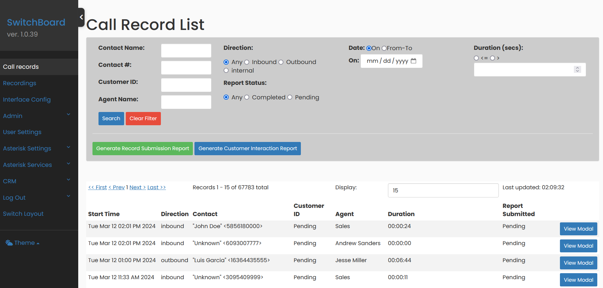
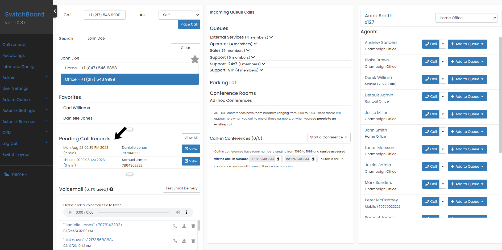
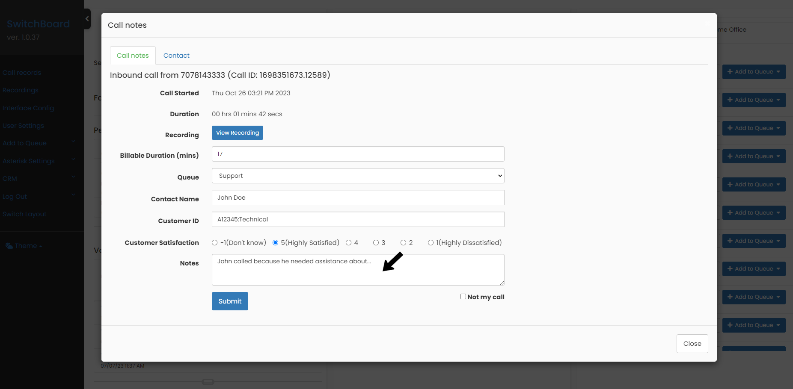

## Call recording

To access your Call Records, go to the `Call records` menu option.

To easily locate a Call Record, use the filters on the page. You can also share the current URL with a colleague at your company, it will include your search without losing the filters.

Note the column on the right that will let you know if a Call Record is still pending to be filled with comments about the call.

## Pending Call Records

To more easily locate pending Call Records (that belong to you as an Agent), you can view the list on the dashboard. To complete a call log, press the `View` button.

## Fill a Call Record

Once you have finished a call, you can fill out the call details. We recommend that you do it as soon as the call ends, this way you will have fresh all the important details you want to keep about the conversation you just had. This will allow your company to locate calls, and keep in mind that you can search for them years later. That is the importance of filling out call records.

By filling out a Call Record you will have the recording of the call available for reference.

You will receive an email every time you fill out a Call Record, with all the feedback details included in the comments. This way, if you ever want to search for a conversation by topic, we recommend searching using your email client's filters.
