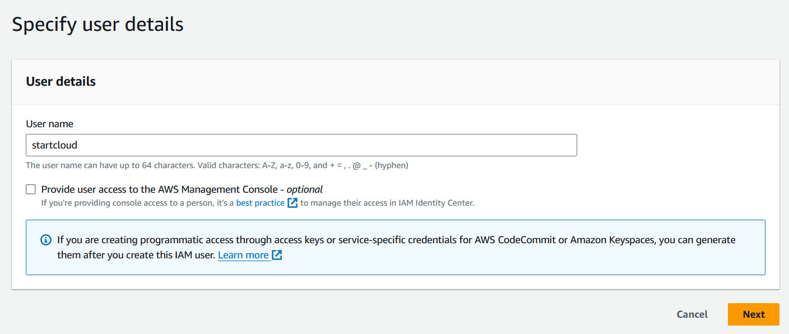
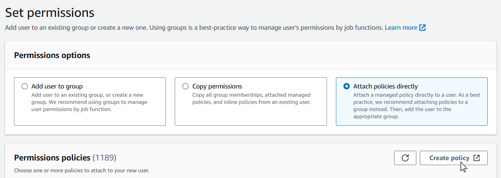
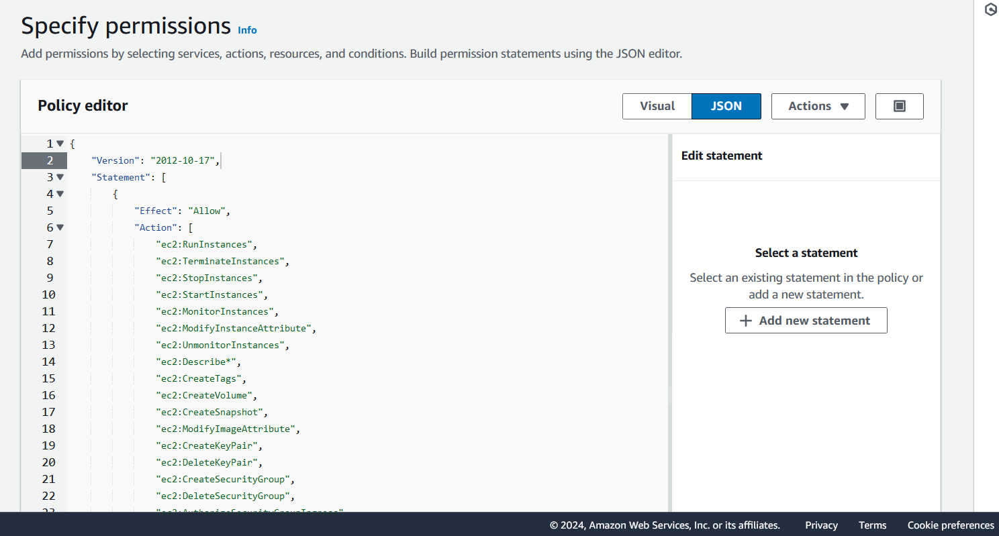
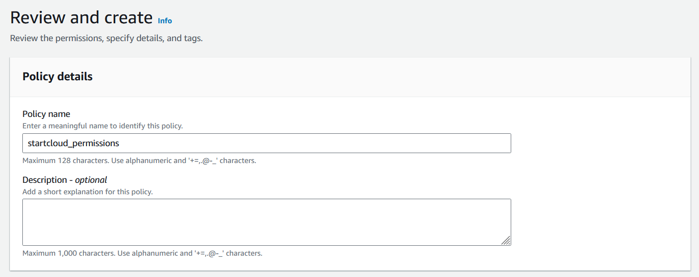
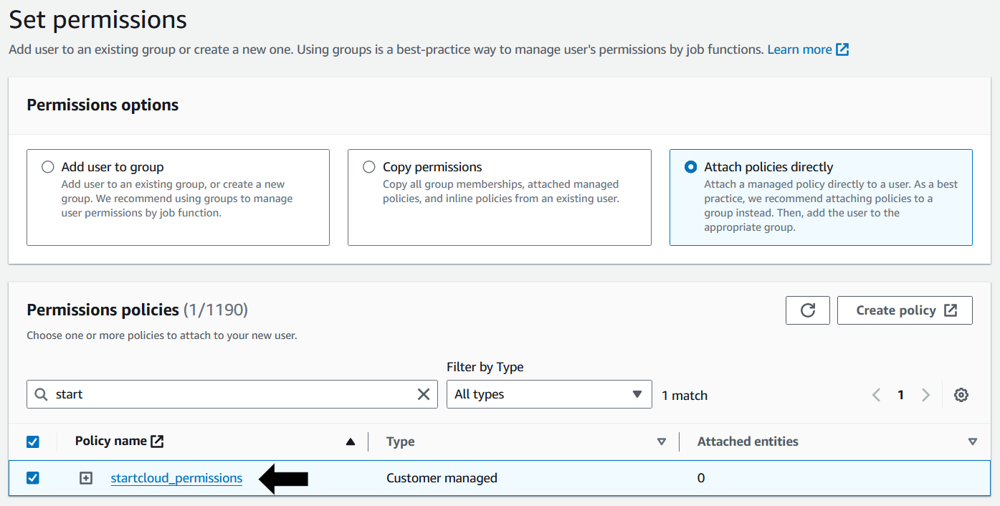
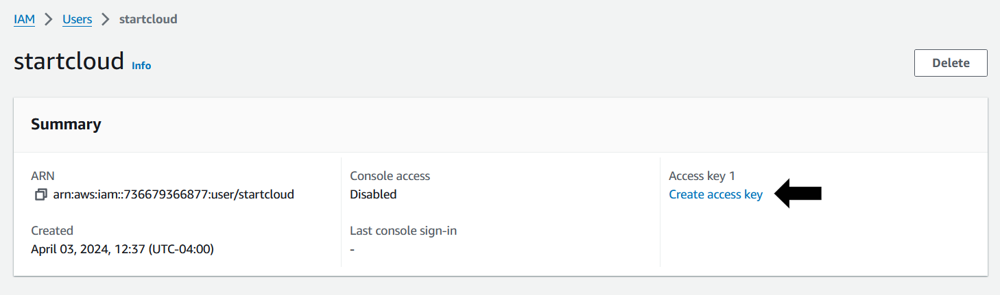
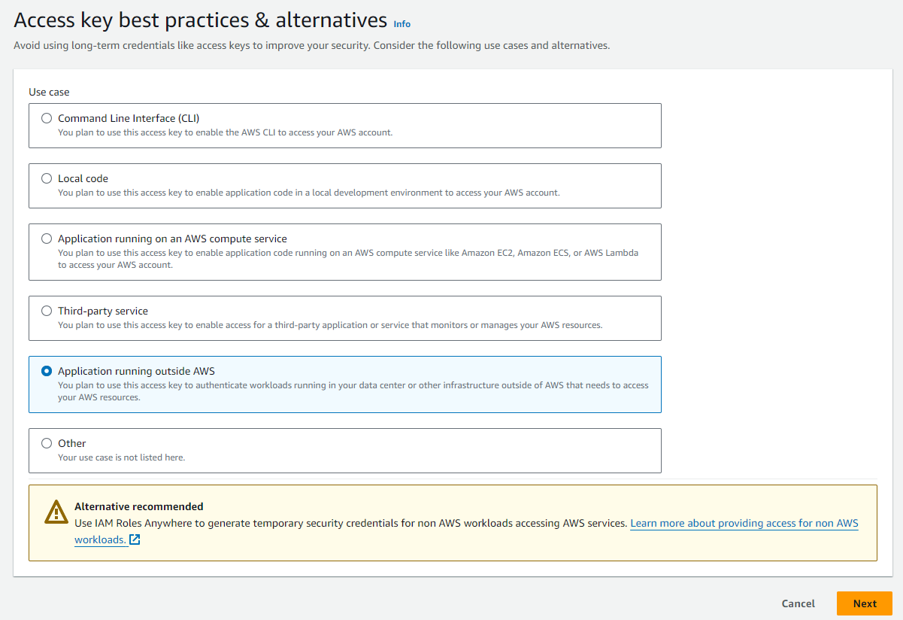
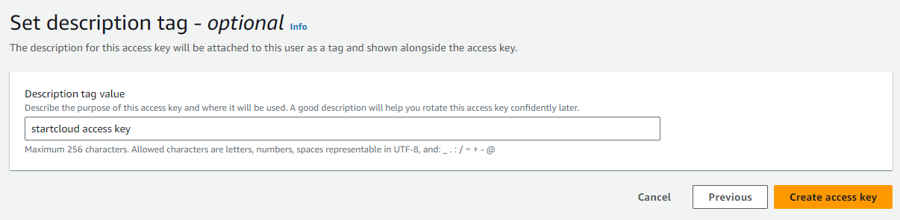
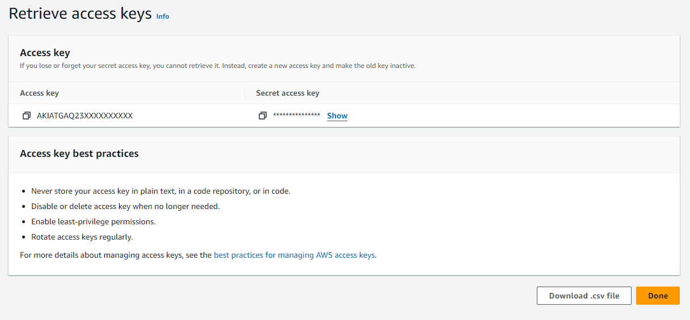
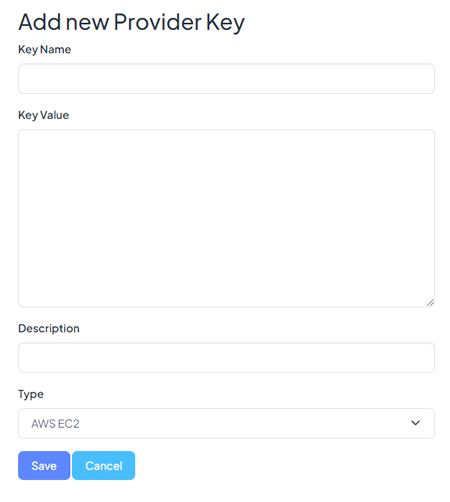

## Cloud Providers

**STARTcloud** is able to deploy and manage applications across multiple cloud-providers. Before launching your first Instance, you need to give us access to your on-demand cloud platform provider.

1. #### **AWS**

- **Create a New User**

If you choose to use **AWS**, please [sign in](https://signin.aws.amazon.com/signin) to your account there. At the top left go to the menu option `Services` -> `IAM` -> `Users` -> `Create User`.

Assign a referential user name for access to the application you are going to launch. Also, you can leave the **Provide user access to the AWS Management Console** option unchecked.

Select `Attach policies directly` and then `Create policy`.

Now, choose `JSON` and replace the content in the Policy editor with the following code. Then click `Next`.
(Note that you will be giving access with the access key that we are creating, only to the application at the IP Address 192.103.6.92).

<pre><code><small><small>
{
  "Version": "2012-10-17",
  "Statement": [
    {
      "Effect": "Allow",
      "Action": [
        "ec2:RunInstances",
        "ec2:TerminateInstances",
        "ec2:StopInstances",
        "ec2:StartInstances",
        "ec2:MonitorInstances",
        "ec2:ModifyInstanceAttribute",
        "ec2:UnmonitorInstances",
        "ec2:Describe*",
        "ec2:CreateTags",
        "ec2:CreateVolume",
        "ec2:CreateSnapshot",
        "ec2:ModifyImageAttribute",
        "ec2:CreateKeyPair",
        "ec2:DeleteKeyPair",
        "ec2:CreateSecurityGroup",
        "ec2:DeleteSecurityGroup",
        "ec2:AuthorizeSecurityGroupIngress"
      ],
      "Resource": "*",
      "Condition": {
        "IpAddress": {
          "aws:SourceIp": [
            "199.103.6.92/32"
          ]
        }
      }
    }
  ]
}
</small></small></code></pre>

Set a Policy name and click `Create Policy`.

Go back to the list of Users and click on `Create User` using the policy we just created. (You can use the search field to find it). Click on `Next` and the user should have been created successfully.

- **Create Access Key**

Go back to the **Users** list and choose the user you just created. Now select the `Create Access Key` option.

- **Copy your Access Key to the STARTcloud Integrations**

  

