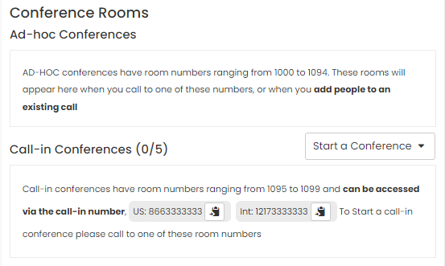

## Conference Rooms

On the Dashboard there is a space reserved for Conference Rooms. There are 2 types of conferences, `Ad-hoc` and `Call-in`.

  

 If you want to make an internal conference, between your office colleagues (a call of more than 2 people), use _Ad-hoc_ conferences. To start one, call the first person and then add people to the call, using the `Add to Call` button next to each Agent's name in the agent list.

Now, if you want to include clients or people outside the organization in the call, you must start a _Call-in_ conference, in one of the 5 available rooms. The first agent to join this conference will be the administrator, and the conference can be started in several ways:

- From the `Start a Conference` button.

  

- Placing a Call to one of the Call-in Conference Rooms, from _1095_ to _1099_.

  

- If the first person to join is a customer who used the call-in number. You can find the call-in number always displayed in the space reserved for call-in conference calls.

  

