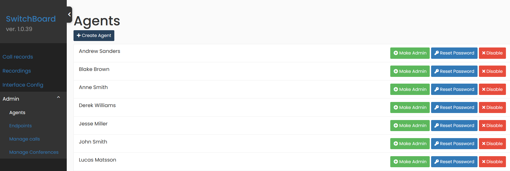
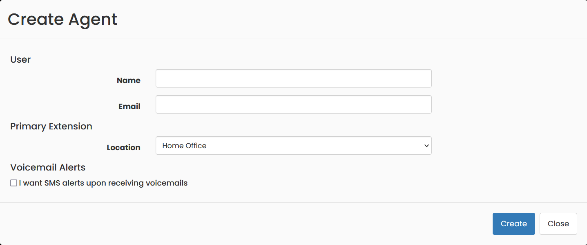
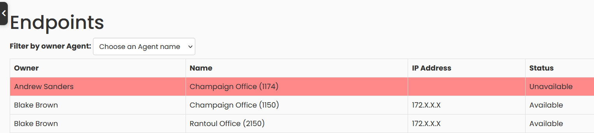
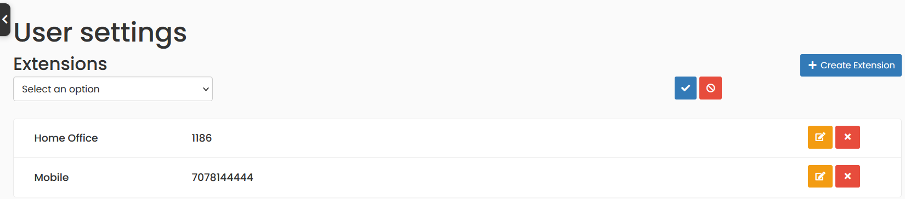

## Agents

Only if you are a user with Administrator access, you will be able to see the Admin Menu option. To create and configure Agents, Go to `Admin` -> `Agents`, in that page you will be able to change the password of an agent, enabling or disabling, among other options.

Use the `Create Agent` button to easily add a new agent. Please note that an agent can have more than one extension assigned, this does not mean that you should create more than one agent for a person.

## Extensions or Endpoints

Go to the menu option `Admin` -> `Extensions`, where you will find a list of all the existing extensions and their current connection status to the telephone system.

To create a new extension to your agent, from which you are logged in, go to the Menu option: `User Settings`.

## Set Up your VoIP Phone

Connect your VoIP phone to the network. We recommend working with **Yealink** TXXG phones. More on how to connect your phone [here](https://support-cdn.yealink.com/attachment/upload/attachment/2016-7-8/3/73b4c514-dd7e-4677-a2df-b52d12699bd9/Yealink_SIP-T27G_Quick_Start_Guide_V80_1.pdf).

Once connected, from the phone go to Menu -> Status and check the IPv4 address given to your phone.

Use that IP address to access the phone's configuration page from your browser. Get a detailed guide on how to access this page [here](https://www.3cx.com/sip-phones/manually-configure-yealink-t32g-t38g-t42g-t46g/).

Go to the Account tab and use the following image as a reference to configure your phone.

The Server host is the IP address where your **Asterisk** service is installed.
