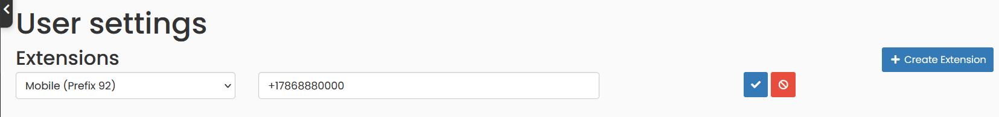
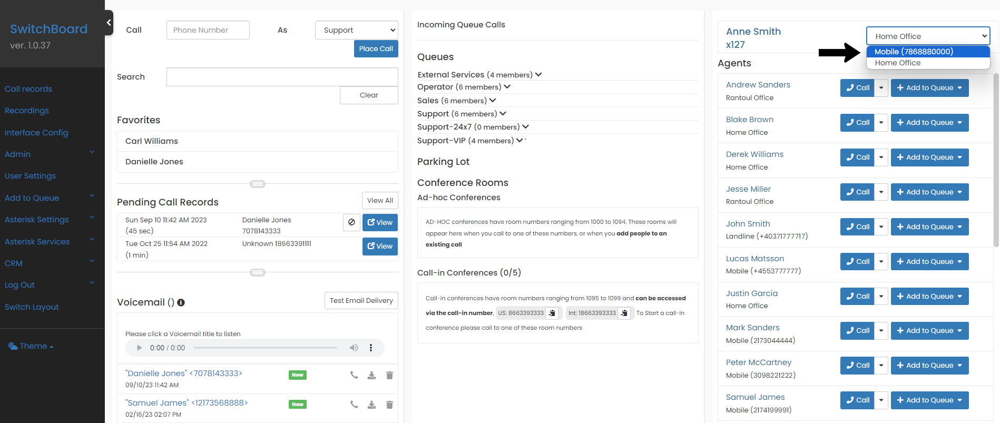

## Agents

Only if you are a user with Administrator access, you will be able to see the Admin Menu option. To create and configure Agents, Go to `Admin` -> `Agents`, in that page you will be able to change the password of an agent, enabling or disabling, among other options.

Use the `Create Agent` button to easily add a new agent. Please note that an agent can have more than one extension assigned, this does not mean that you should create more than one agent for a person.

## View list of Extensions or Endpoints

Go to the menu option `Admin` -> `Extensions`, where you will find a list of all the existing extensions and their current connection status to the telephone system.

## Create new Local Extension

To create a new extension to your agent, from which you are logged in, go to the Menu option: `User Settings`.

## Create new Mobile Extension

You can also use your mobile phone to make and receive calls from the Switchboard interface. We recommend using a phone connected to the local network, but if you are out of the office one day you can use your cell phone and stay connected to the phone system.

To create a mobile extension go to `User Settings` -> `Create Extension`. Choose Mobile type, with any of the prefixes (but you cannot have more than one mobile extension with the same prefix). Note that the resulting extension number will be = the prefix + agent number.

The system will treat your cell phone as another extension, but internally there are some differences when connecting a call, since it will have an extra channel to connect with your device.

Remember that you can work with your cell phone if you make and answer calls from the Switchboard Interface (not from your cell phone).

It's important that you tell the application which of your extensions you're currently connected from. To do this, easily configure your Primary extension in the dashboard at the top right, as you can see in the image below.

