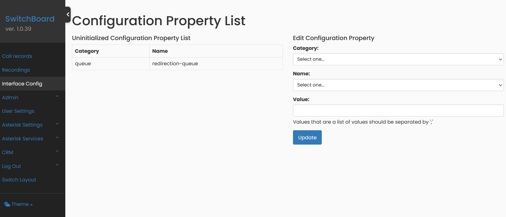

## Main configuration variables for your interface

Once you log in to your interface, go to the `Interface Config` menu option.

You will find a List of Uninitialized Configuration Properties, on the left of the page, with those properties that you must set, one time, so that your phone system is correctly configured to be able to make phone calls.

Below is a list where you will find all the configuration variables, with a description that explains the purpose of each in the operation of the system, along with an example value for each of them.

| **Category** | **Property**                   | **Description**                                                                                                                                                                        |
|--------------|--------------------------------|----------------------------------------------------------------------------------------------------------------------------------------------------------------------------------------|
| general      | asterisk_host                  | Server name or IP address of the server where Asterisk is installed. E.g: vagrant.asterisk                                                                                             |
| general      | postgres_host                  | Server name or IP address of the server where Postgres database is installed. E.g: vagrant.postgres                                                                                    |
| general      | postgres_username              | Postgres user, owner or privileged user in your Postgres configuration to log and access the database from the Switchboard interface. E.g: asterisk_role                               |
| general      | postgres_password              | Password of the Postgres user that you chose in postgres_username, to connect and access the database from the Switchboard interface. E.g: 12345678                                    |
| general      | postgres_port                  | The PostgreSQL database service is available by default on port 5432. But if you have a custom configuration that uses a different connection port, you can specify it here. E.g: 5433 |
| dialer       | dial_out_trunk                 | Here you should put the name of the Trunk created to connect with your favorite communications provider that you hired to make calls (in case you have more than one provider) E.g: twilio-trunk                                                                                                                                                                      |
| dialer       | domestic_cid                   | It's the phone number that others see when you're calling them (for calls within the US). E.g: 8777368888                                                                                                                                                                        |
| dialer       | international_cid              | International Caller ID, it's the phone number that others see when you're calling them, for international calls. E.g: 12173568888                                                                                                                                                                       |
| dialer       | international_dial_out_code    | International dialing code for the United States. E.g: 011                                                                                                                                                                               |
| dialplan     | agent_dest_appdata             | E.g: agents;AGENTID;1                                                                                                                                                                  |
| dialplan     | internal_context               | Name of the context used in the dialplan for incoming calls to agents and also for internal calls between agents. E.g: agents                                                                                                                                                                            |
| dialplan     | primary_trunk                  | Here you should put the name of the Trunk created to connect with your favorite communications provider that you hired to receive calls (in case you have more than one provider) E.g: twilio- trunk                                                                                                                                                                      |
| dialplan     | queue_dest_appdata             | E.g: queues;QUEUENAME;1                                                                                                                                                                |
| dialplan     | trunk_context                  | Name of the context used in the dialplan to handle incoming calls. E.g: from-peer                                                                                                                                                                         |
| manager      | password                       | Password that we use to connect to the Asterisk Management Interface (AMI). This password is stored in the asterisk_config DB table, you can filter by filename='manager.conf'. E.g: password                                                                                                                                                                          |
| manager      | username                       | Username that we use to connect to the Asterisk Management Interface (AMI). This username is stored in the asterisk_config DB table, you can filter by filename=’manager.conf’. E.g: switchboard                                                                                                                                                                       |
| call_record  | ignore_list                    | Callee number that you want us to ignore in the Call Records list if you call him. E.g: 2171110000                                                                                                                                                                                  |
| contacts     | failover_import                | E.g: 5940                                                                                                                                                                              |
| contacts     | primary_host                   | Name or IP of the server where the Postgres database that contains the contact data is located. E.g: vagrant.postgres                                                                                                                                                                  |
| contacts     | secondary_host                 | Name or IP of the backup server where the Postgres database that contains the contact data is located. This value is optional. E.g: vagrant.contacts_backup                                                                                                                                                                     |
| mail         | call_record_report_receipients | Every time you fill out a Call Record, a notification email is sent to a list of people interested in monitoring this information. Those people's email addresses should be in this list, separated by semicolons. E.g: email@domain.com; email2@domain.com                                                                                                                                                                  |
| mail         | call_record_summary_recipients | Once a week, a report is sent via email to inform how many Call Records (for the current week) are pending to be filled out by each agent. In this list you'll have the email addresses of the people who receive this report, separated by semicolons. E.g: email@domain.com; email2@domain.com                                                                                                                                               |
| mail         | from_address                   | Email address from which Switchboard sends emails. E.g: email@domain.com                                                                                                                                                                  |
| mail         | outbound_mail_host             | Email server from which you send emails. E.g: mail.domain.com                                                                                                                                                            |
| recording    | base_directory                 | File directory where audio files for every call are automatically saved, regardless of which agent made or received it. E.g: /nfs-mounts/asterisk/recording                                                                                                                                                    |
| voicemail    | base_directory                 | File directory where the audio files of received voicemails are saved. Asterisk works with the INBOX, Old and Deleted folders within a folder for each agent, which will be the Agent ID. E.g: /nsf-mounts/asterisk/voicemail/101/INBOX prominic                                                                                                                                           |
| voicemail    | display_folders                | Voicemail audio files, included in these folders, which will be displayed in an agent's Dashboard. E.g: INBOX;Old                                                                                                                                                                         |
| voicemail    | email_host                     | E.g: 172.11.11.11                                                                                                                                                                      |
| voicemail    | folders                        | The folders that Asterisk needs in its file directory to save and manage voicemail audio files for each Agent. E.g: INBOX;Old;DELETED                                                                                                                                                                 |
