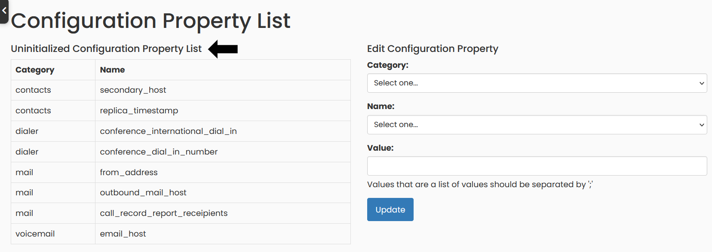

## Main configuration variables for your interface

Once you log in to your interface, go to the `Interface Config` menu option.

You will find a List of Uninitialized Configuration Properties, on the left of the page, with those properties that you must set, one time, so that your phone system is correctly configured to be able to make phone calls.

Below is a list where you will find all the configuration variables, with a description that explains the purpose of each in the operation of the system, along with an example value for each of them.

| **Category** | **Property**                   | **Description**                                                                                                                                                                        |
|--------------|--------------------------------|----------------------------------------------------------------------------------------------------------------------------------------------------------------------------------------|
| general      | asterisk_host                  | Server name or IP address of the server where Asterisk is installed. E.g: vagrant.asterisk                                                                                             |
| general      | postgres_host                  | Server name or IP address of the server where Postgres database is installed. E.g: vagrant.postgres                                                                                    |
| general      | postgres_username              | Postgres user, owner or privileged user in your Postgres configuration to log and access the database from the Switchboard interface. E.g: asterisk_role                               |
| general      | postgres_password              | Password of the Postgres user that you chose in postgres_username, to connect and access the database from the Switchboard interface. E.g: 12345678                                    |
| general      | postgres_port                  | The PostgreSQL database service is available by default on port 5432. But if you have a custom configuration that uses a different connection port, you can specify it here. E.g: 5433 |
| dialer       | dial_out_trunk                 | E.g: flowrouteaws                                                                                                                                                                      |
| dialer       | domestic_cid                   | E.g: 8777368888                                                                                                                                                                        |
| dialer       | international_cid              | E.g: 12173568888                                                                                                                                                                       |
| dialer       | international_dial_out_code    | E.g: 011                                                                                                                                                                               |
| dialplan     | agent_dest_appdata             | E.g: agents;AGENTID;1                                                                                                                                                                  |
| dialplan     | internal_context               | E.g: agents                                                                                                                                                                            |
| dialplan     | primary_trunk                  | E.g: flowrouteaws                                                                                                                                                                      |
| dialplan     | queue_dest_appdata             | E.g: queues;QUEUENAME;1                                                                                                                                                                |
| dialplan     | trunk_context                  | E.g: from-peer                                                                                                                                                                         |
| manager      | password                       | E.g: password                                                                                                                                                                          |
| manager      | username                       | E.g: switchboard                                                                                                                                                                       |
| call_record  | ignore_list                    | E.g:                                                                                                                                                                                   |
| contacts     | failover_import                | E.g: 5940                                                                                                                                                                              |
| contacts     | primary_host                   | E.g: vagrant.postgres                                                                                                                                                                  |
| contacts     | secondary_host                 | E.g: MISSING_VALUE                                                                                                                                                                     |
| mail         | call_record_report_receipients | E.g: email@domain.com                                                                                                                                                                  |
| mail         | call_record_summary_recipients | E.g: email@domain.com; email2@domain.com                                                                                                                                               |
| mail         | from_address                   | E.g: email@domain.com                                                                                                                                                                  |
| mail         | outbound_mail_host             | E.g: domino-42.prominic.net                                                                                                                                                            |
| recording    | base_directory                 | E.g: /nfs-mounts/asterisk/recording                                                                                                                                                    |
| voicemail    | base_directory                 | E.g: /nsf-mounts/asterisk/voicemail/prominic                                                                                                                                           |
| voicemail    | display_folders                | E.g: INBOX;Old                                                                                                                                                                         |
| voicemail    | email_host                     | E.g: 172.11.11.11                                                                                                                                                                      |
| voicemail    | folders                        | E.g: INBOX;Old;DELETED                                                                                                                                                                 |
