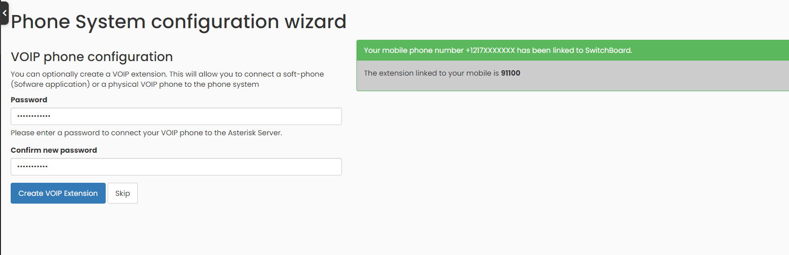
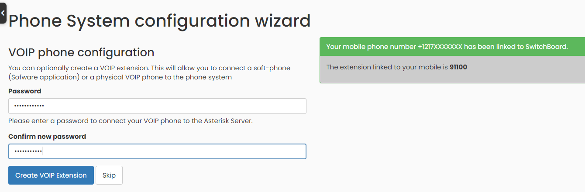
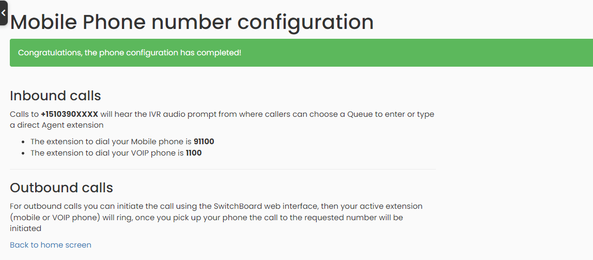

## Launch New Instance of Switchboard Cloud

Before creating your first **Switchboard Cloud** Instance, go to the `Settings` section and create at least one **Cloud Provider**, an **SSH Key** and the minimum **Integrations** necessary to launch your new instance.

Step 1

Step 2

Step 3

Step 4

Step 5

Step 6

Step 7

Step 8

Step 9

Step 10

Step 11

Step 12

Step 13

Step 14

Step 15

