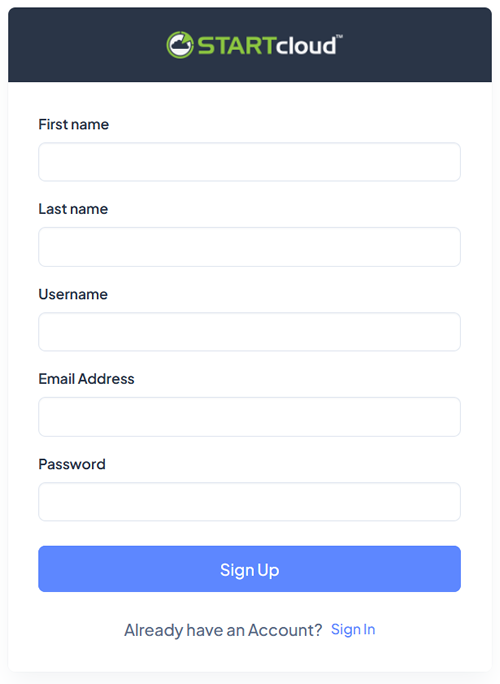
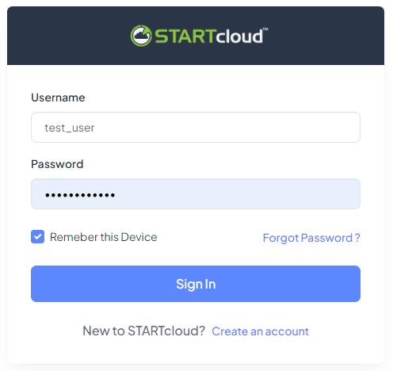

## Launch Switchboard Instance from STARTcloud

Sign Up to the **STARTcloud** platform by following this [link](http://startcloud.com/registration).

  

Once you are registered, [log in](http://startcloud.com/login). You can follow the link on the same page `Already have an Account? Sign In`.

  

Before creating your first **Switchboard Cloud** Instance, go to the `Settings` section and create at least one **Cloud Provider**, an **SSH Key** and the minimum **Integrations** necessary to launch your new instance.

