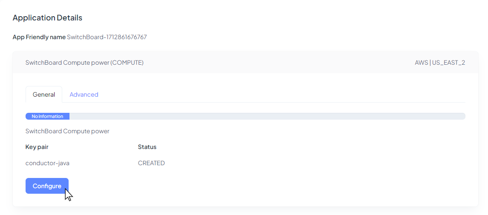
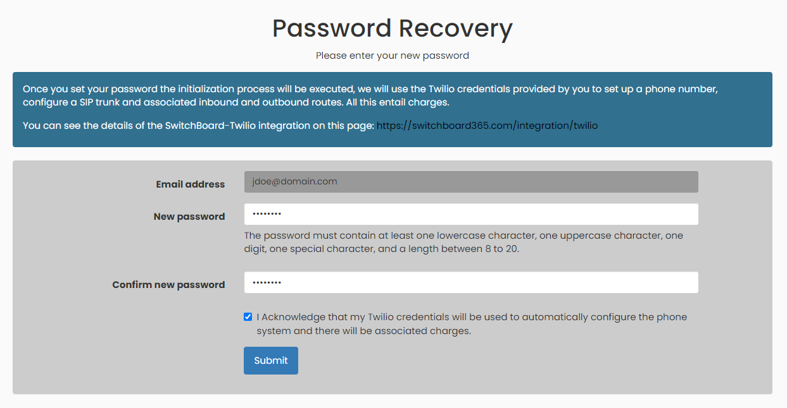
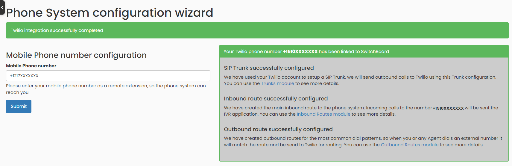

## Launch New Instance of Switchboard Cloud

Before creating your first **Switchboard Cloud** Instance, go to the `Settings` section and create at least one [**Cloud Provider**](./../docs/cloud_provider), an [**SSH Key**](./../docs/ssh_key) and the minimum [**Integrations**](./../docs/twilio) necessary to launch your new instance.

After completing the previous steps, go to the `Marketplace` menu option and choose to deploy the **Switchboard Cloud** application.

You will immediately see an application in the list, click on its name.

And proceed to `Edit` the details of this application.

In the next step, select:
1. **The provider** where you want to deploy your instance.
2. **The cloud provider authentication**. That integration previously done following the guide on the [Cloud Providers page](./../docs/cloud_provider).
3. **The region**: Cloud providers host computing resources in multiple locations around the world. You can choose where to deploy your application, preferably close to your end users.

Now select,
1. An **SSH Key** with which you want to authenticate the **STARTcloud** application on your cloud provider.
2. Also, in the **Rule Type**, enable traffic for ports 5060-5061 which are the ones **Asterisk** uses for communications.
3. And lastly add your IP address to the allowed **IP range**.

Set up the email address and full name of the administrator user for the telephone application.

Select the necessary integrations before launching the new instance. Integration with a telephone service provider is required, not optional.

The instance will take about _20 minutes_ to reach the `COMPLETED` status. Once the process is finished you can access it from the **login link**.

Welcome to the set-up wizard of your new telephone application. Set a login password for your Administrator user.

In this step an initialization process will be executed. In this way we will automatically create a **SIP Trunk**, an [**Inbound Route**](./../docs/inbound_route), as well as some [**Outbound Routes**](./../docs/outbound_route) for the main telephone patterns. These are all necessary steps for a phone application to make and receive phone calls. The **SIP Trunk** is the link between your Telephone Service Provider and your **Switchboard Cloud** application. You can find more details about **SIP Trunks** [here](./../docs/trunk).

Now, we will create the first phone extension, which will be your _mobile phone number_. Please enter it below.

Also, you can configure a _VoIP phone_ in this step, or if you wish you can do it later. A password will be required to establish a connection with each peer. Set up one in this step and don't forget to save it in your records. More details on how to configure _VoIP phones_ to connect to your phone application can be found [here](./../docs/phone_config).

The initialization process of the Phone System has been completed.

