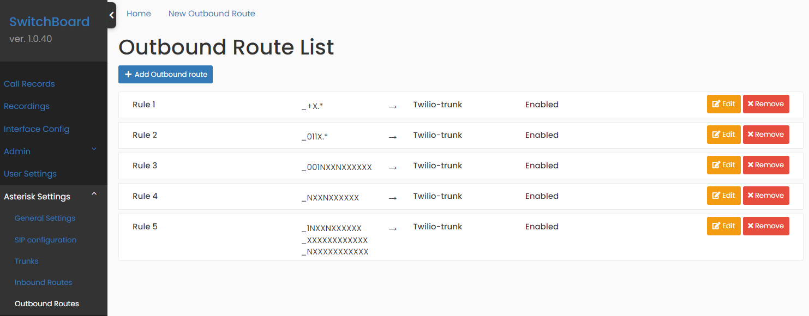
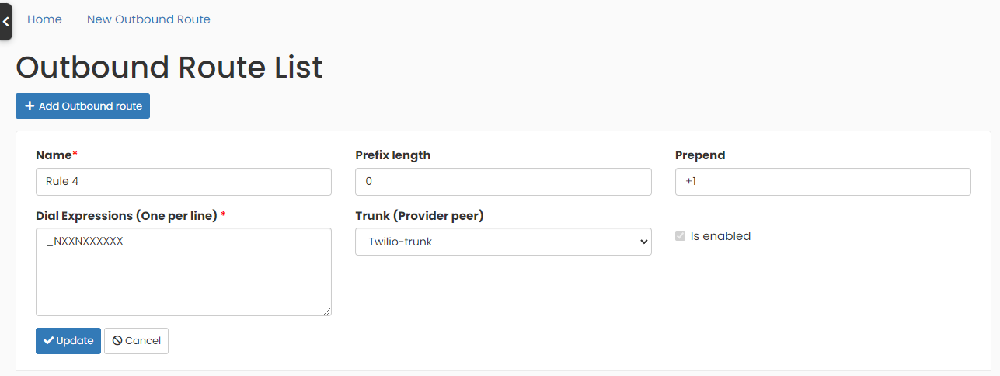

## Outbound Routes

Outbound Routes are available in the Menu option `Asterisk Settings` -> `Outbound Routes`, only for administrator users.

An **outbound route** is used to tell the **PBX** how to process outbound calls and which **trunk** to use. Every time a user dials a number, the **PBX** will compare the dialed number with different patterns that we have defined as Rules or Outbound Routes.

If a pattern matches, the **PBX** will route the call out using the associated **trunk**. If it doesn't match, the **PBX** will try to match the dialed number with the pattern on the next defined Rule.

  

If you want to learn more about Patterns on Outbound Routes configuration, you can use this [link](https://help.yeastar.com/en/s-series/topic/dial_patterns_of_outbound_route.html).
