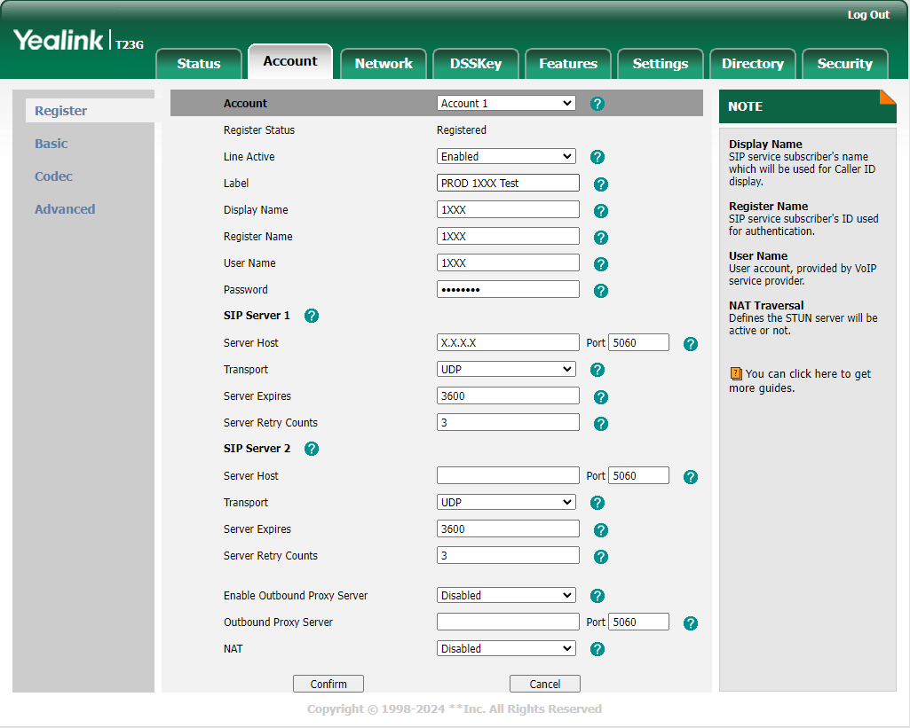

## Set Up your VoIP Phone

Connect your VoIP phone to the network. We recommend working with [**Yealink TX Series Phones**](https://www.yealink.com/en/product-list/ip-phone?filter=t3). More on how to connect your phone [here](https://support-cdn.yealink.com/attachment/upload/attachment/2016-7-8/3/73b4c514-dd7e-4677-a2df-b52d12699bd9/Yealink_SIP-T27G_Quick_Start_Guide_V80_1.pdf).

Once connected, <ins>from the phone</ins> go to `Menu` -> `Status` and check the IPv4 address given to your phone.

Use that IP address to access the phone's configuration page from your browser. Get a detailed guide on how to access this page [here](https://www.3cx.com/sip-phones/manually-configure-yealink-t32g-t38g-t42g-t46g/).

Go to the Account tab and use the following image as a reference to configure your phone.

* The `Display Name`, `Register Name` and `User Name` are the extension number, which you previously configured for your agent in the Switchboard Interface.

* The Password is the one stored in the `ps_auths` DB table, for your extension.

* The Server host is the IP address where your **Asterisk** service is installed. In this example we use a local IP address, ideal for the case in which your VoIP phone is connected to your company's local network, normally via a wired network connection.

## Set Up a Soft Phone

You can choose between the different brands of Softphones available on the market. For this demo we chose to use **3CX**. You can go to their [website](https://www.3cx.com/voip/softphone/) and click on `Get started: Download the free softphone here`.

Once the software has been downloaded and installed, go to `Set accounts`, and then Create a wew account, using the `New` button. Below is a reference image so you have an idea of how to configure your soft phone.

* Note that the `Caller ID`, `Extension` and `ID` are the extension number, which you previously configured for your agent in the Switchboard Interface.

* The Password is the one stored in the `ps_auths` DB table, for your extension.

* The external IP is the IP address of your server, where the **Asterisk** service is installed. Include port _5060_ in the IP address, as this is the one **Asterisk** uses by default to communicate.
