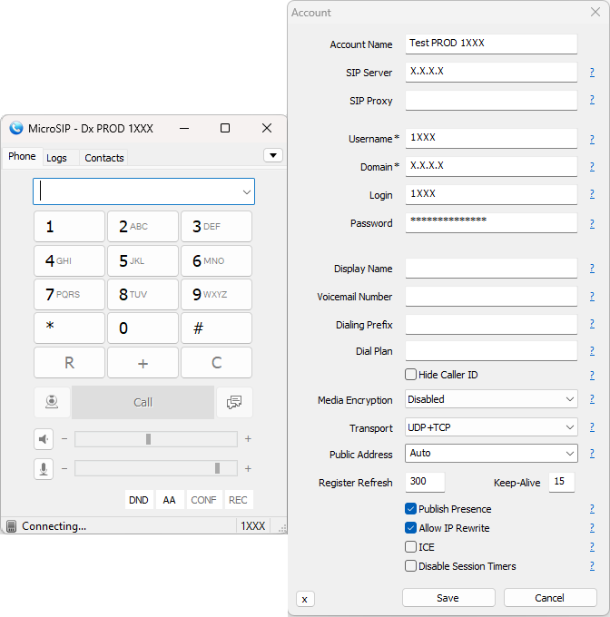

## Set Up your VoIP Phone

Connect your VoIP phone to the network. We recommend working with [**Yealink TX Series Phones**](https://www.yealink.com/en/product-list/ip-phone?filter=t3). More on how to connect your phone [here](https://support-cdn.yealink.com/attachment/upload/attachment/2016-7-8/3/73b4c514-dd7e-4677-a2df-b52d12699bd9/Yealink_SIP-T27G_Quick_Start_Guide_V80_1.pdf).

Once connected, <ins>from the phone</ins> go to `Menu` -> `Status` and check the IPv4 address given to your phone.

Use that IP address to access the phone's configuration page from your browser. Get a detailed guide on how to access this page [here](https://www.3cx.com/sip-phones/manually-configure-yealink-t32g-t38g-t42g-t46g/).

Go to the Account tab and use the following image as a reference to configure your VoIP phone.

* The `Display Name`, `Register Name` and `User Name` are the extension number, which you previously configured for your agent in the **Switchboard Cloud** Interface.

* The Password is the one stored in the `ps_auths` DB table, for your extension.

* The Server host is the IP address where your **Asterisk** service is installed. In this example we use a local IP address, ideal for the case in which your VoIP phone is connected to your company's local network, normally via a wired network connection.

## Set Up a Soft Phone

You can choose between the different brands of Softphones available on the market.

<!-- Tab links -->

  <button class="tablinks" onclick="openCity(event, 'Microsip')">Microsip</button>
  <button class="tablinks" onclick="openCity(event, 'Zoiper')">Zoiper</button>
  <button class="tablinks" onclick="openCity(event, '3CX')">3CX</button>

<!-- Tab content -->

  <h3>Microsip</h3>
  To use <b>Microsip</b>, an open source portable SIP softphone for <b>Windows</b>, based on <b>PJSIP</b>; you can go to the downloads on their <a href="https://www.microsip.org/downloads">website</a>, and choose the version you want to install.
    
		Once the software has been downloaded and installed, go to the down arrow icon -> <code class="language-plaintext highlighter-rouge">Add account</code>.
	  
	

  	
  

   
  

  	
  

   
  <ul>
	  <li>
	  	
The <code class="language-plaintext highlighter-rouge">Account Name</code> is the name you want to give to the account, which is sufficiently explicit if you later have several accounts configured on your softphone.

	  </li>
	  <li>
	    
The <code class="language-plaintext highlighter-rouge">SIP Server</code> and <code class="language-plaintext highlighter-rouge">Domain</code> are the IP address, local or public, of the server where the <b>Asterisk</b> service to which you want to connect your calls is installed (Or the IP address of the instance you launched from <strong>STARTcloud</strong>).

	  </li>
	  <li>
	    
The <code class="language-plaintext highlighter-rouge">Username</code> and <code class="language-plaintext highlighter-rouge">Login</code> are the Extension number. Remember that in <b>Switchboard Cloud</b> an Agent can have more than one extension number. Make sure you choose the right one.

	  </li>
	  <li>
	    
The <code class="language-plaintext highlighter-rouge">Password</code> is the one you configured for your VoIP extension. You can also find it stored in the <strong>ps_auths</strong> DB table, for your extension number.

	  </li>
	</ul>

  <h3>Zoiper</h3>
  If you decide to use <b>Zoiper</b>, you can go to their <a href="https://www.zoiper.com/en/voip-softphone/download/current">website</a> and click on <code class="language-plaintext highlighter-rouge">Download</code>, based on the operating system you use.
    
	Once the software has been downloaded and installed, go to <code class="language-plaintext highlighter-rouge">Settings</code> (gear icon) -> <code class="language-plaintext highlighter-rouge">Accounts</code> -> <code class="language-plaintext highlighter-rouge">Add</code>. Below is a reference image so you have an idea of how to configure your soft phone.
	  
	

  	
  

   
  <ul>
  	<li>
	  	
You can click the Pencil Icon at the top center to set an explicit <code class="language-plaintext highlighter-rouge">Account Name</code>.

	  </li>
  	<li>
	    
The <code class="language-plaintext highlighter-rouge">Domain</code> is the IP address of your server, where the <strong>Asterisk</strong> service is installed (Or the IP address of the instance you launched from <strong>STARTcloud</strong>).

	  </li>
  	<li>
	  	
The <code class="language-plaintext highlighter-rouge">Username</code> is the extension number, which you previously configured for your agent in the <b>Switchboard Cloud</b> Interface.

	  </li>
	  <li>
	    
The <code class="language-plaintext highlighter-rouge">Password</code> is the one you configured for your VoIP extension. You can also find it stored in the <strong>ps_auths</strong> DB table, for your extension number.

	  </li>

	</ul>

  <h3>3CX</h3>
  If you decide to use <b>3CX</b>, you can go to their <a href="https://www.3cx.com/voip/softphone/">website</a> and click on <code class="language-plaintext highlighter-rouge">Get started: Download the free softphone here</code>.
    
	Once the software has been downloaded and installed, go to <code class="language-plaintext highlighter-rouge">Set accounts</code>, and then Create a wew account, using the <code class="language-plaintext highlighter-rouge">New</code> button. Below is a reference image so you have an idea of how to configure your soft phone.
	  
	

  	
  

   
  <ul>
  	<li>
	  	
The <code class="language-plaintext highlighter-rouge">Account Name</code> is the name you want to give to the account, which is sufficiently explicit if you later have several accounts configured on your softphone.

	  </li>
	  <li>
	  	
Note that the <code class="language-plaintext highlighter-rouge">Caller ID</code>, <code class="language-plaintext highlighter-rouge">Extension</code> and <code class="language-plaintext highlighter-rouge">ID</code> are the extension number, which you previously configured for your agent in the <b>Switchboard Cloud</b> Interface.

	  </li>
	  <li>
	    
The <code class="language-plaintext highlighter-rouge">Password</code> is the one configured for your VoIP extension. You can also find it stored in the <strong>ps_auths</strong> DB table, for your extension number.

	  </li>
	  <li>
	    
The external IP is the IP address of your server, where the <strong>Asterisk</strong> service is installed (Or the IP address of the instance you launched from <strong>STARTcloud</strong>). Include port <em>5060</em> in the IP address, as this is the one <strong>Asterisk</strong> uses by default to communicate.

	  </li>
	</ul>

