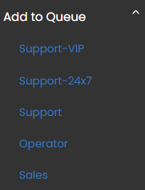
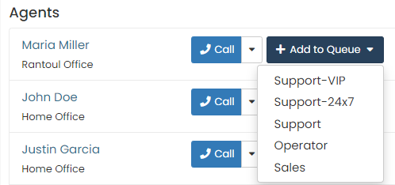
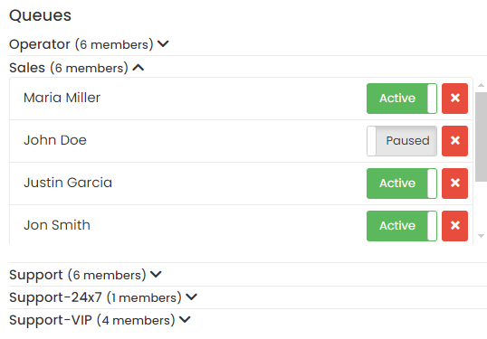

## Queue configuration

To add yourself, the Agent who logged in, to one of the existing queues, you can use the `Add to Queue` option in the left menu.

  

Additionally, you can add other agents to queues from the `Add to Queue` button, located to the right of the agent name in the agent list.

  

Note that an Agent can be _Paused_ or _Active_ in a queue, and you can manage it from the list of queues in the dashboard.

  

