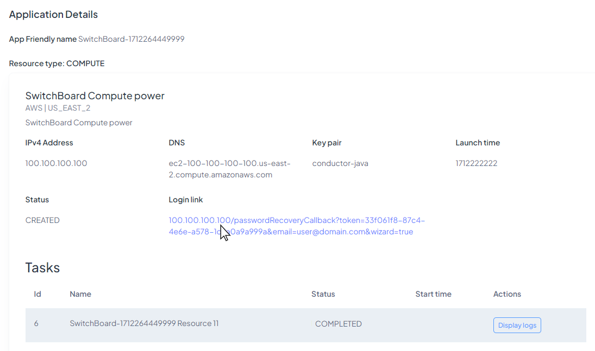
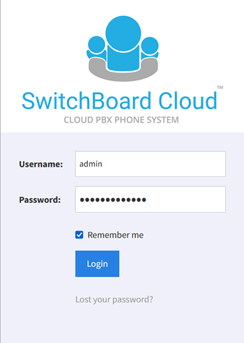

## Log in to the Phone Interface

You will find a link to enter your Phone Application when logging into **STARTcloud** and going to `My Applications`. Select the application you want to open and click on the _Login link_.

Now you just have to log in and start using **Switchboard Cloud**.

  

