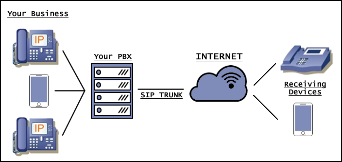
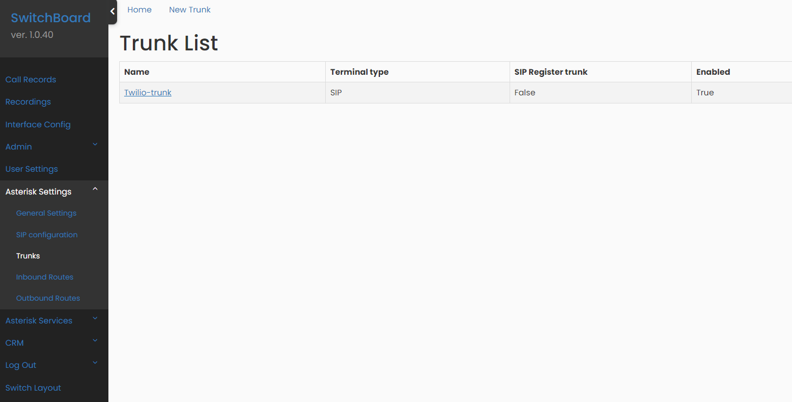
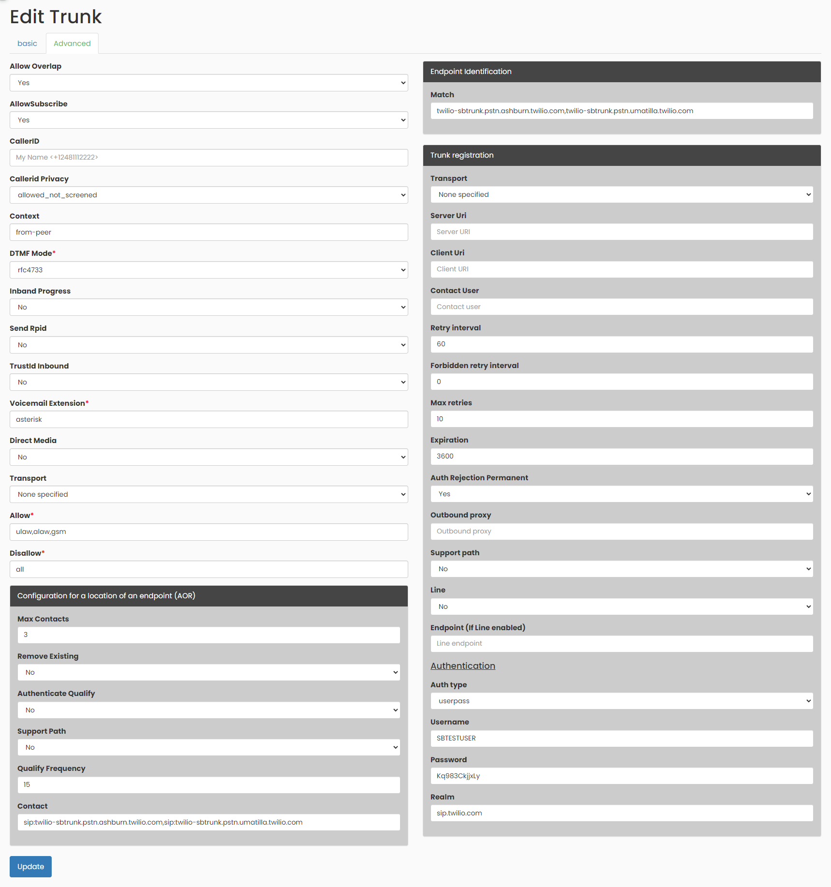

## SIP Trunks

Session Initiation Protocol (**SIP**) trunking is a service offered by a communications provider that uses the protocol to provision voice over IP (**VoIP**) connectivity between an on-premises phone system and the public switched telephone network (**PSTN**). SIP is used for call establishment, management and teardown.

The SIP Trunking service allows you to connect your IP exchange (**PBX**) with a telephone service over the Internet. Thus, you will be able to make and receive calls with the capacity of up to 30 simultaneous voice channels at a very low price.

The **SIP** Trunking service performs authentication via IP, so in order to use it, your IP must be fixed. Otherwise, if you have a dynamic IP, you can use the **SIP** Line, which allows authentication by registering a username and password.

  

In Switchboard we create a trunk in the initial configuration of your interface, that process is transparent for you. If you want to see more details of the created trunk you can go to the Menu option `Asterisk Settings` -> `Trunks`, available only for administrator users.

Also, if you are an experienced user, there is also option to configure Advanced settings, in the `Advanced` tab.

If you want to learn more about Trunks configuration, you can use this [link](https://www.twilio.com/en-us/blog/sip-trunk-vs-sip-line).
