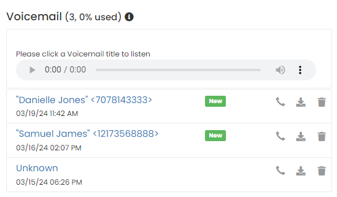

## Voicemail

If you don't answer an incoming call, the caller can leave a voice message. You can access messages from your voicemail list in **Switchboard Cloud** Dashboard.

Select the message you want to listen to by clicking on it, and it will be loaded into the player.

  

**Asterisk** internally manages 3 folders to save the audio files of an agent's voice messages. These folders are `INBOX`, `Old` and `Deleted`.

A new message is stored in _INBOX_, an already listened to message goes to _Old_, and a deleted message goes to _Deleted_, so it's possible that your network administrator, accessing the server via SSH, can recover a file that you deleted by mistake.
